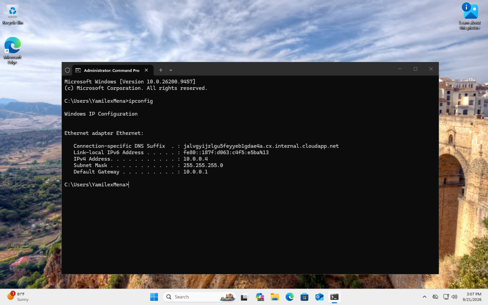
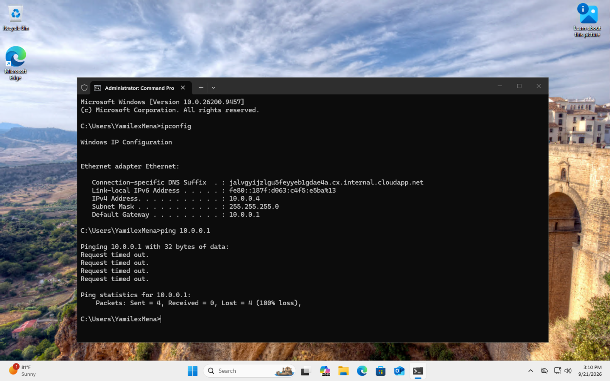
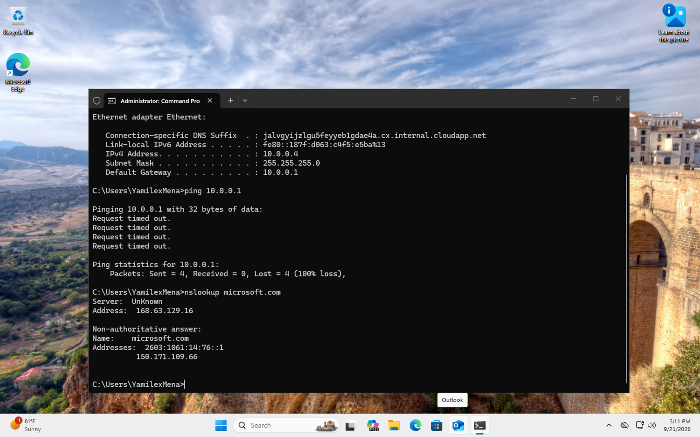

# Troubleshooting Network Connectivity

## Objective

Use Windows networking commands to review IP configuration, test connectivity, and verify DNS resolution inside an Azure virtual machine.

## Step 1: Review the Network Configuration

Used `ipconfig` to review the VM's IPv4 address, subnet mask, and default gateway.

## Step 2: Test Gateway Connectivity

Used `ping` to test the configured default gateway and reviewed the timeout and packet-loss results.

## Step 3: Test DNS Resolution

Used `nslookup` to verify that the VM could successfully resolve `microsoft.com`.

## Skills Demonstrated

- Network Troubleshooting
- Windows Command Prompt
- TCP/IP Fundamentals
- IPv4 Addressing
- DNS Troubleshooting
- `ipconfig`
- `ping`
- `nslookup`
- Azure Virtual Machines
